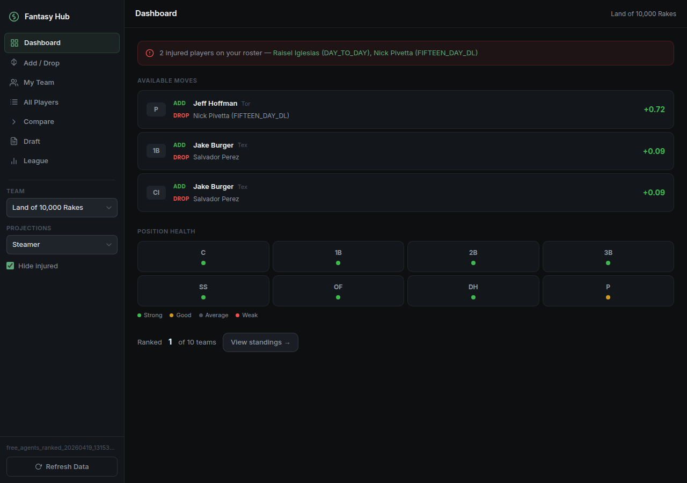
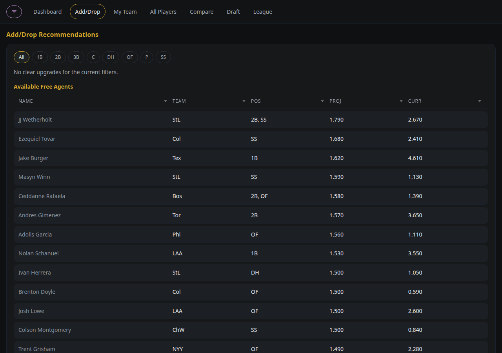
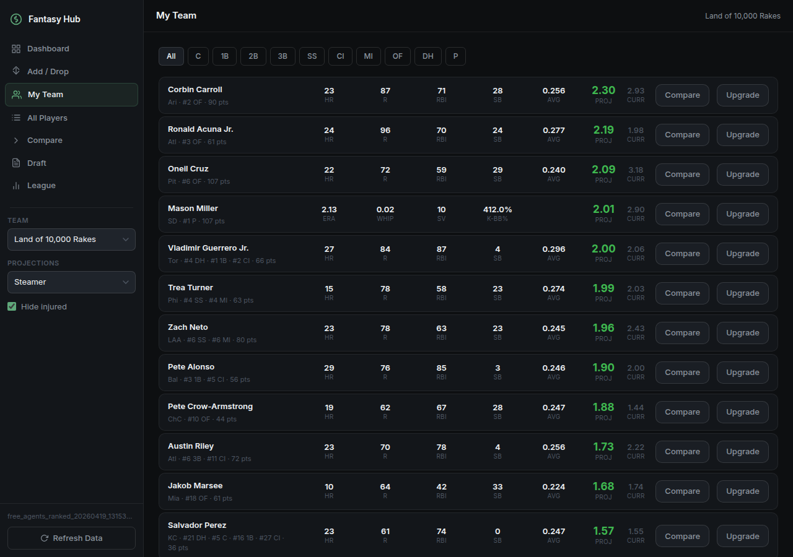
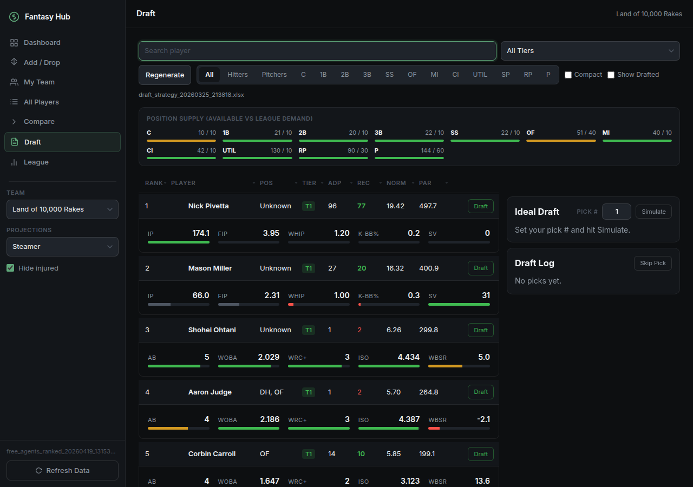

# Fantasy Baseball Hub

Fantasy baseball analysis platform combining ESPN league data with FanGraphs projections. FastAPI + Jinja2, dark-themed, mobile-optimized.

Position health, top recommended moves, and league rank.



Free agent upgrades by position with projected score deltas.



Full roster with projected and current scores.



Draft simulator with tier rankings, ADP, and position supply.



## Quick Start

```bash
python3 -m venv venv && source venv/bin/activate
pip install -r requirements.txt
cp env.example .env   # add your ESPN credentials
mkdir -p output
uvicorn src.server.main:app --host 0.0.0.0 --port 8000
```

Open http://localhost:8000

## Configuration

```bash
LEAGUE_ID=your_league_id
SEASON=2026
SWID={your_swid_cookie}
ESPN_S2=your_espn_s2_cookie
```

Get `SWID` and `espn_s2` from browser DevTools → Application → Cookies → espn.com. Your league ID is in the ESPN league URL (`leagueId=XXXXXXX`).

## Pages

| Page | Route | Description |
|---|---|---|
| Dashboard | `/` | Position strength vs. league average |
| Add/Drop | `/add-drop` | Free agents ranked by projected score |
| My Team | `/team` | Your roster with proj/current scores |
| All Players | `/players` | Searchable, paginated player table |
| Compare | `/compare` | Side-by-side player comparison |
| Draft | `/draft` | Interactive draft board with position supply |
| League | `/league` | All teams ranked by projected score |

The sidebar on every page lets you switch teams, toggle injured players, and trigger a live data refresh.

## Run as a System Service

To keep the app running after closing your terminal or editor, install it as a systemd service:

```bash
# Replace YOUR_USER and /path/to/FantasyBaseball in fantasy-baseball.service, then:
sudo cp fantasy-baseball.service /etc/systemd/system/
sudo systemctl daemon-reload
sudo systemctl enable fantasy-baseball
sudo systemctl start fantasy-baseball
```

View logs: `journalctl -u fantasy-baseball -f`

## Docs

- [Setup Guide](docs/SETUP.md)
- [API Reference](docs/API.md)

## Acknowledgements

Uses [espn-api](https://github.com/cwendt94/espn-api) by cwendt94.

## License

MIT
